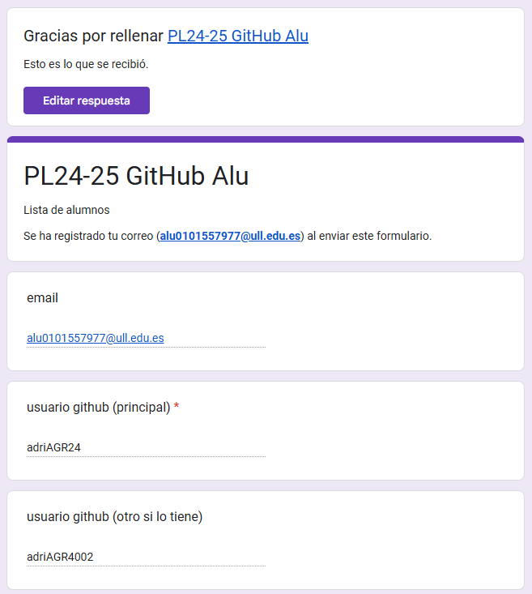
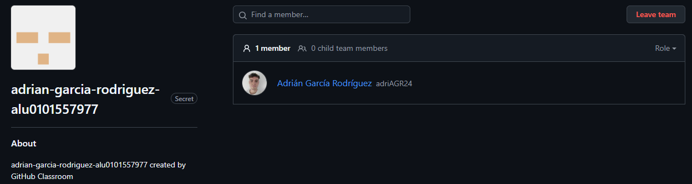
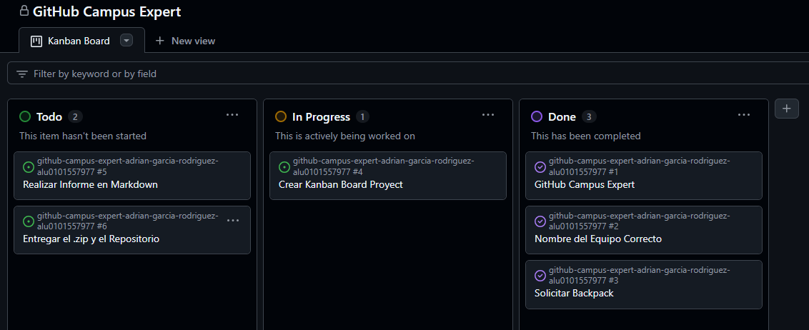

# Github Campus Expert 

- Adrián
- García Rodríguez
- alu0101557977

## Cuestionario GitHub-Alu del campus virtual

## Nombre del equipo según el formato indicado

## Project Board Kanban para el repositorio asignado

## GitHub Backpack solicitado

